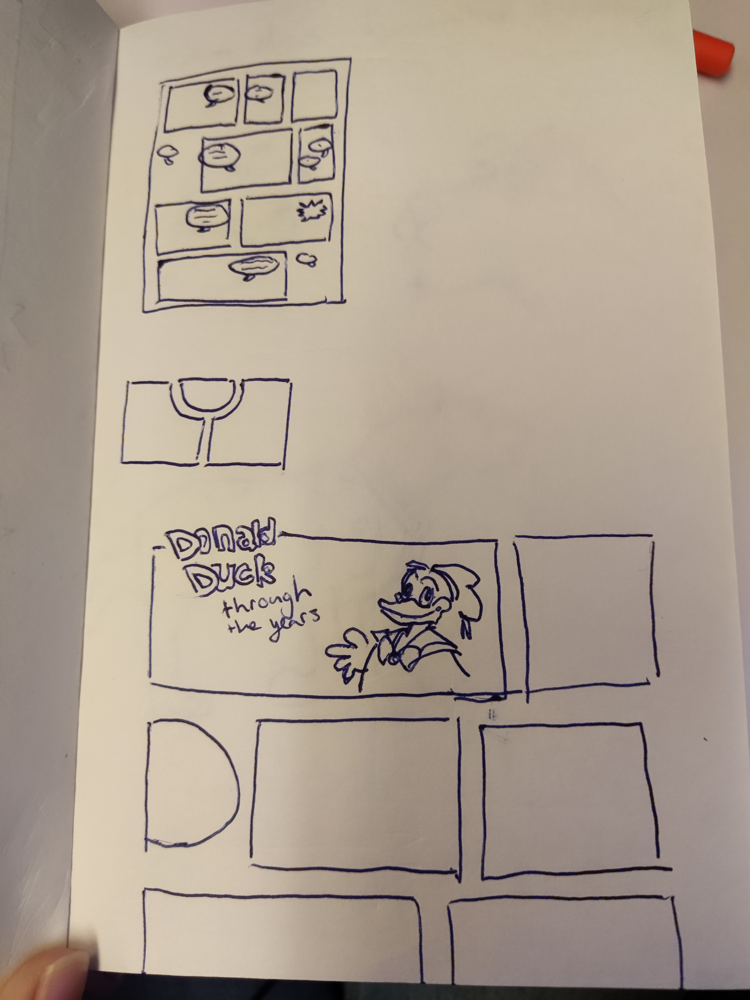
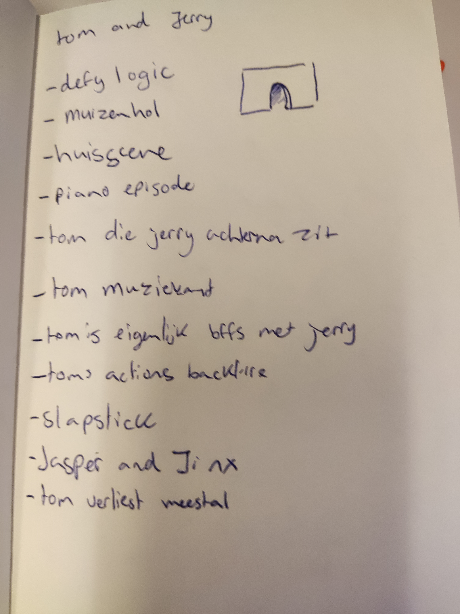
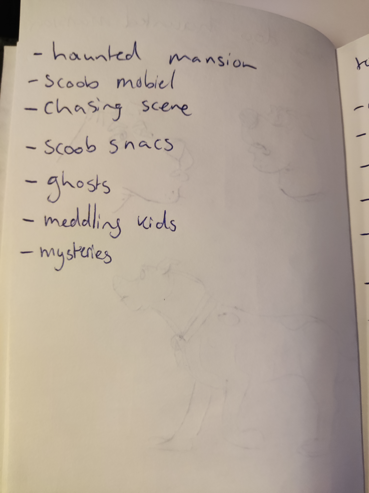

# Procesverslag
Markdown is een simpele manier om HTML te schrijven.  
Markdown cheat cheet: [Hulp bij het schrijven van Markdown](https://github.com/adam-p/markdown-here/wiki/Markdown-Cheatsheet).

Nb. De standaardstructuur en de spartaanse opmaak van de README.md zijn helemaal prima. Het gaat om de inhoud van je procesverslag. Besteedt de tijd voor pracht en praal aan je website.

Nb. Door *open* toe te voegen aan een *details* element kun je deze standaard open zetten. Fijn om dat steeds voor de relevante stuk(ken) te doen.

## Jij

### Ontwerper:
Sasja Koning

#### Je startniveau:
Mijn startniveau is: 	~~Zwart~~ Blauw

# Je plan

  
Eerste ideeen

  Ter voorbereiding op dit project heb ik een lijst gemaakt van mogelijk interessante karakters om te gebruiken voor de tijdlijn. Hierbij heb ik gekeken naar karakters die een rijke historie hebben en mijn interesses trekken.

  Hierbij was bij mij nog wat onduidelijkheid over wat voor soort tijdlijn ik kon gaan maken. Of deze op basis moest van echte tijd of fictieve tijd zoals in een serie. 

  - Tom en Jerry
  - Mickey Mouse
  - Donald Duck
  - Minecraft (Steve)
  - Pac Man
  - Shrek
  - Simpsons (Homer)
  - Scooby Doo (Scooby)
  - Adventure Time (Marceline)
  - Clippy (Office Assistant)
  - Game Of Thrones (Bijv. Deanerys)
  - Avatar (Bijv. Aang)
  - Kim Possible
  - Fairy Odd Parents
 

  
De eerste versie/schets van je ontwerp & je persoonlijke uitdaging

  ### De eerste versies/schetsen:
  Voor mijn eerste schetsen was ik uitgekomen op drie verschillende thema's. Op deze ideeen heb ik feedback gekregen van Ine van den Hoven.

  1: **Donald Duck**
   
  Een stripverhaal pagina over donald duck.
  Hierin zouden typische "donald" elementen staan zoals zijn neefjes, oom, "temperment" etc. Als kind heb ik veel stripverhalen over Donald Duck gelezen waardoor dit karakter nostalgische waarde heeft.
  

  **Feedback** 
  Het idee om de tijdlijn af te beelden in een stripverhaal was sterk. Meeste mensen kennen Donald Duck namelijk van de stripverhalen. Er zouden animaties, videos en informatie kunnen worden getoond wanneer de gebruiker om een strip paneel klikt.

  2: **Tom and Jerry**
   
  ik ben met Tom and Jerry opgegroeid. Bijna elke episode ken ik wel uit mijn hoofd. In deze schets het ik een typische Tom and Jerry setting gemaakt waarbij de gebruiker Tom (en Jerry) volgt door het huis op een komische en "slapstick" manier.    Wat Tom echt Tom maakt is Jerry. Hierdoor is het lastig om het alleen over Tom te houden. Dit zou dan een uitzondering op de opdracht zijn met twee karakters. (of twee karakters met focus op Tom)
  
  

  **Feedback**
  Het idee dat Deze tijdlijn zich afspeeld in een huis is sterk omdat Tom and Jerry zich daar vaak in afspeeld. Informatie in dit huis kan dan bijvoorbeeld worden gegeven door een pop up of in schilderijen waar de gebruiker interactie mee heeft. Ook kan ik meer kenmerkende dingen van Tom and Jerry terug laten komen in onder andere de achtergronden.

  3: **Scooby Doo**
   
  Scooby Doo heeft vele vormen van entertainment gezien. Stripverhalen, cartoons, films, live action etc. In deze schets heb ik een "haunted mansion" gemaakt waar Scooby Doo op een komische manier zijn tijdlijn laat zien. Dit maar het uniek voor Scooby Doo door zijn typische animaties en objecten zoals Scooby Snacks.
  
  

  **Feedback**
  Dit idee was het minst sterk van de drie. Ik kon mogelijk nog wat meer manieren van informeren toe voegen naast gebruik van deuren. Ook kon ik meerdere soorten stijlen toevoegen.

  ### Je ambitie: 
  Aan deze technieken/punten wil ik werken:
  - punt 1
  - punt 2
  - nog een punt
  - ...
 

## Tijdlijn Tom and Jerry

- 1940
  - Start Tom and Jerry, MGM en Hanna Barbera. In de eerste episode werken Tom en Jerry nog Jasper en Jinx genoemd.
- 1954
  - MGM halveerd het budget van Tom and Jerry, animatie kwaliteit daalt
- 1957
  - Door té hoge kostten word de studio voor Tom and Jerry gesloten
- 1958
  - Releases van shorts gestopt
- 1961
  - MGM outsourced Tom and Jerry animatie naar Gene Deitch die eigenlijk de cartoons helemaal niet leuk vond. Kwaliteit gaat achteruit.
- 1962
  - Laatste short van het contract met Gene Deitch
- 1963
  - Animatie origine terug naar America. Overname Chuck Jones. Deze hield meer een eigen stijl aan.
- 1967
  - Einde productie animatie van Chuck Jones
- 1975
  - Start "Tom and Jerry Show", Hanna Barbera. Alle geweld is weg en Tom and Jerry zijn nu beste vrienden. 
- 1980
  - Start "Tom and Jerry Comedy Show" Show met meerdere karakters, Voor productie waren Filmation ingehuurd. Zij gingen meer voor quantity dan quality. Veel herbuik van animatie en minder frames per seconde. Simplelere muziek. Fans vonden het slecht.
- 1990-1993
  - Start "To and Jerry Kids" met baby versies van Tom en Jerry. Animatie en muziek waren van hogere kwaliteit. 65 episodes.
- 1992
  - Release "Tom and Jerry the movie" gemaakt door Film Roman. De film flopte echter hard.
- 2001
  - Release "Tom and Jerry The Mansion Cat" Overname Hanna Barbera door Warner Brothers, tiend agen voor de dood van Hanna
- 2005
  - Laatste release van een short, "The Karate Guard". Een aantal maanden na release overleed Barbera.
- 2006-2008
  - Start "Tom and Jerry Tales" een Cartoon Network serie met 26 episodes van een half uur.
- 2014
  - Start "Tom and Jerry Show" op Cartoon Network
- 2021
  - Release Tom and Jerry film in theaters

## Voortgang/Feedback 1

  
Mijn bevindingen + wijzigingen (minimaal 5)

  ### Bevinding 1:
  Omschrijving van wat er nog niet orde was (tekst en afbeeding(en)).

  #### oplossing:
  Beschrijving hoe je het hebt hebt opgelost of als het niet gelukt is hoe je het zou oplossen (tekst en afbeeding(en)).

  ### Bevinding 2:
  Omschrijving van wat er nog niet orde was (tekst en afbeeding(en)).

  #### oplossing:
  Beschrijving hoe je het hebt hebt opgelost of als het niet gelukt is hoe je het zou oplossen (tekst en afbeeding(en)).

  ### Bevinding 3:
  ...

## Voortgang/Feedback 2

  
Mijn bevindingen + wijzigingen (minimaal 5)

  
  ### Bevinding 1:
  Omschrijving van wat er nog niet orde was (tekst en afbeeding(en)).

  #### oplossing:
  Beschrijving hoe je het hebt hebt opgelost of als het niet gelukt is hoe je het zou oplossen (tekst en afbeeding(en)).

  ### Bevinding 2:
  Omschrijving van wat er nog niet orde was (tekst en afbeeding(en)).

  #### oplossing:
  Beschrijving hoe je het hebt hebt opgelost of als het niet gelukt is hoe je het zou oplossen (tekst en afbeeding(en)).

  ### Bevinding 3:
  ...

## Voortgang/Feedback 3

  
Mijn bevindingen + wijzigingen (minimaal 5)

  
  ### Bevinding 1:
  Omschrijving van wat er nog niet orde was (tekst en afbeeding(en)).

  #### oplossing:
  Beschrijving hoe je het hebt hebt opgelost of als het niet gelukt is hoe je het zou oplossen (tekst en afbeeding(en)).

  ### Bevinding 2:
  Omschrijving van wat er nog niet orde was (tekst en afbeeding(en)).

  #### oplossing:
  Beschrijving hoe je het hebt hebt opgelost of als het niet gelukt is hoe je het zou oplossen (tekst en afbeeding(en)).

  ### Bevinding 3:
  ...

## Reflectie

  
Mijn eindresultaat & persoonlijke ontwikkeling

  ### Je uitkomst - karakteristiek screenshot(s):
  

  ### Dit ging goed/Heb ik geleerd: 
  Korte omschrijving met plaatje(s)

  

  ### Dit was lastig/Is niet gelukt:
  Korte omschrijving met plaatje(s)

  

## Bronnenlijst

continu bijhouden terwijl je werkt

Nb. Wees specifiek ('css-tricks' als bron is bijv. niet specifiek genoeg).

1. bron 1
2. bron 2
3. ...

