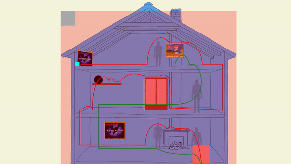

# Procesverslag

## Jij

### Ontwerper:
Sasja Koning

#### Je startniveau:
Mijn startniveau is: 	Zwart

# Je plan

  
Eerste ideeen

  Ter voorbereiding op dit project heb ik een lijst gemaakt van mogelijk interessante karakters om te gebruiken voor de tijdlijn. Hierbij heb ik gekeken naar karakters die een rijke historie hebben en mijn interesses trekken.

  Hierbij was bij mij nog wat onduidelijkheid over wat voor soort tijdlijn ik kon gaan maken. Of deze op basis moest van echte tijd of fictieve tijd zoals in een serie. 

  - Tom en Jerry
  - Mickey Mouse
  - Donald Duck
  - Minecraft (Steve)
  - Pac Man
  - Shrek
  - Simpsons (Homer)
  - Scooby Doo (Scooby)
  - Adventure Time (Marceline)
  - Clippy (Office Assistant)
  - Game Of Thrones (Bijv. Deanerys)
  - Avatar (Bijv. Aang)
  - Kim Possible
  - Fairy Odd Parents
 

  
De eerste versie/schets van je ontwerp & je persoonlijke uitdaging

  ### De eerste versies/schetsen en Feedback sessie 1:
  Voor mijn eerste schetsen was ik uitgekomen op drie verschillende thema's. Op deze ideeen heb ik feedback gekregen van Ine van den Hoven.

  1: **Donald Duck**
   
  Een stripverhaal pagina over donald duck.
  Hierin zouden typische "donald" elementen staan zoals zijn neefjes, oom, "temperment" etc. Als kind heb ik veel stripverhalen over Donald Duck gelezen waardoor dit karakter nostalgische waarde heeft.
  

  **Feedback** 
  Het idee om de tijdlijn af te beelden in een stripverhaal was sterk. Meeste mensen kennen Donald Duck namelijk van de stripverhalen. Er zouden animaties, videos en informatie kunnen worden getoond wanneer de gebruiker om een strip paneel klikt.

  2: **Tom and Jerry**
   
  ik ben met Tom and Jerry opgegroeid. Bijna elke episode ken ik wel uit mijn hoofd. In deze schets het ik een typische Tom and Jerry setting gemaakt waarbij de gebruiker Tom (en Jerry) volgt door het huis op een komische en "slapstick" manier.    Wat Tom echt Tom maakt is Jerry. Hierdoor is het lastig om het alleen over Tom te houden. Dit zou dan een uitzondering op de opdracht zijn met twee karakters. (of twee karakters met focus op Tom)
  
  

  **Feedback**
  Het idee dat Deze tijdlijn zich afspeeld in een huis is sterk omdat Tom and Jerry zich daar vaak in afspeeld. Informatie in dit huis kan dan bijvoorbeeld worden gegeven door een pop up of in schilderijen waar de gebruiker interactie mee heeft. Ook kan ik meer kenmerkende dingen van Tom and Jerry terug laten komen in onder andere de achtergronden.

  3: **Scooby Doo**
   
  Scooby Doo heeft vele vormen van entertainment gezien. Stripverhalen, cartoons, films, live action etc. In deze schets heb ik een "haunted mansion" gemaakt waar Scooby Doo op een komische manier zijn tijdlijn laat zien. Dit maar het uniek voor Scooby Doo door zijn typische animaties en objecten zoals Scooby Snacks.
  
  

  **Feedback**
  Dit idee was het minst sterk van de drie. Ik kon mogelijk nog wat meer manieren van informeren toe voegen naast gebruik van deuren. Ook kon ik meerdere soorten stijlen toevoegen.

  ### Je ambitie: 
  Aan deze technieken/punten wil ik werken:
  - Ik wil beter een verhaal kunnen vertellen via een website.
  - Ik wil complexe animaties leren maken.
  - Ik wil nieuwe CCS en SVG technieken leren.
 

## Tijdlijn Tom and Jerry

- 1940
  - Start Tom and Jerry, MGM en Hanna Barbera. In de eerste episode werken Tom en Jerry nog Jasper en Jinx genoemd.
- 1954
  - MGM halveerd het budget van Tom and Jerry, animatie kwaliteit daalt
- 1957
  - Door té hoge kostten word de studio voor Tom and Jerry gesloten
- 1958
  - Releases van shorts gestopt
- 1961
  - MGM outsourced Tom and Jerry animatie naar Gene Deitch die eigenlijk de cartoons helemaal niet leuk vond. Kwaliteit gaat achteruit.
- 1962
  - Laatste short van het contract met Gene Deitch
- 1963
  - Animatie origine terug naar America. Overname Chuck Jones. Deze hield meer een eigen stijl aan.
- 1967
  - Einde productie animatie van Chuck Jones
- 1975
  - Start "Tom and Jerry Show", Hanna Barbera. Alle geweld is weg en Tom and Jerry zijn nu beste vrienden. 
- 1980
  - Start "Tom and Jerry Comedy Show" Show met meerdere karakters, Voor productie waren Filmation ingehuurd. Zij gingen meer voor quantity dan quality. Veel herbuik van animatie en minder frames per seconde. Simplelere muziek. Fans vonden het slecht.
- 1990-1993
  - Start "To and Jerry Kids" met baby versies van Tom en Jerry. Animatie en muziek waren van hogere kwaliteit. 65 episodes.
- 1992
  - Release "Tom and Jerry the movie" gemaakt door Film Roman. De film flopte echter hard.
- 2001
  - Release "Tom and Jerry The Mansion Cat" Overname Hanna Barbera door Warner Brothers, tien dagen voor de dood van Hanna
- 2005
  - Laatste release van een short, "The Karate Guard". Een aantal maanden na release overleed Barbera.
- 2006-2008
  - Start "Tom and Jerry Tales" een Cartoon Network serie met 26 episodes van een half uur.
- 2014
  - Start "Tom and Jerry Show" op Cartoon Network
- 2021
  - Release Tom and Jerry film in theaters

## Tussentijdse screenshot

## Voortgang/Feedback 2

  
Mijn bevindingen + wijzigingen

  Op maandag 7 november heb ik samen met mede-student Sandra een feedbacksessie gehouden. Voor deze sessie hebben wij een checklist aangehouden voor details, verzorging en nette code.

  
  

  Onderstaand is een GIF van mijn werk getoond tijdens deze feedback sessie:
   
  

  ### Bevinding 1:
  De pagina is een beetje responsive maar niet zoveel als ik zou willen hebben.

  #### oplossing:
  Dit wil ik gaan oplossen door wat oude media queries the verwijderen en dit in zijn geheel te laten scalen.

  ### Bevinding 2:
  De gebruiker kan nog niet interactie hebben met elementen door middel van tab. Dit komt omdat de klikbare elementen <figure>'s zijn en niet <button>s. 

  #### oplossing:
  Ik ga de klikbare elementen vervangen met buttons. Hier ga ik ook aria labels aan toevoegen.

  ### Lijst kleine fixes en edits
  - Ik heb nog geen teksten gebruikt in mijn werk. Hierdoor heb ik ook nog geen custom fonts toegevoegd.
  - In de website staan nog een aantal placeholder afbeeldingen die niet bij het geheel passen.
  - Er missen nog states zoals hovers bij elementen.
  - Er staat een <ul> in de code die beter kan worden vervangen door een <ol> omdat deze een vaste volgorde heeft.
  - Er staat een <section> in mijn code die waarschijnlijk overbodig is.
  - De CSS is nog een beetje rommelig.
  - Er worden nog geen CSS variables gebruikt.

## Voortgang/Feedback 3

  
Mijn bevindingen + wijzigingen

  Op woensdag 9 november heb ik samen met een kennis gekeken naar de website.

  Onderstaand is een GIF van mijn werk getoond tijdens deze feedback sessie:
   
  
  
  ### Bevinding 1:
  Wanneer het scherm te klein werdt viel alle css uit elkaar. Dit omdat alles nog af hing van een enkele media query.

  #### oplossing:
  Door de media queries te verwijderen is de website meer responsive geworden. Deze werkt echter alsnog niet goed op schermen kleiner dan een desktop.

  ### Bevinding 2:
  De interactieve elements waren nog niet goed tab-baar en toonde nog geen correcte informatie.

  #### oplossing:
  door sommige elementen te veranderen van divs naar buttons en de correcte teksten toe te voegen kan ik deze problemen oplossen.

  ### Bevinding 3:
  Er mistte nog easter eggs in het ontwerp.

  #### oplossing:
  Deze ga ik toevoegen door onder andere tom and jerry klikbaar te maken met een kleine animatie.

## Reflectie

  
Mijn eindresultaat & persoonlijke ontwikkeling

  ### Je uitkomst - karakteristiek screenshot(s):
  
  

  ### Dit ging goed/Heb ik geleerd: 
  Tijdens dit project heb ik veel geleerd over verschillende technieken en nieuwe html/css/javascript properties. Na even moeite met de keuze maken over welk karakter ik wou gaan gebruiken heb ik erg tevreden over mijn keuze voor Tom and jerry. Ik vond het leuk om mijn eigen stijl in dit project te verwerken door zelf getekende achtergronden en veel animaties. Ik wou graag beter een verhaal vertellen door middel van een website en dit is mij redelijk goed gelukt.

  

  ### Dit was lastig/Is niet gelukt:
  Ik was al snel opgewonden over mijn idee. Dit bleek echter té complex te zijn voor de hoeveelheid tijd die ik had om het te maken. Er zijn een boel dingen die mooier hadden gekund zoals de illustraties, karakters en css elementen. Deze ander halve week hebben mij vooral een mooi concept geleverd maar helaas geen eindresultaat. De kans is groot dat ik verder zal werken aan dit project om het écht portfolio waardig te maken.

  

## Bronnenlijst

Bronnen

Nb. Wees specifiek ('css-tricks' als bron is bijv. niet specifiek genoeg).

1. https://css-tricks.com/container-units-should-be-pretty-handy/
2. https://developer.mozilla.org/en-US/docs/Web/CSS/offset-path
3. https://developer.mozilla.org/en-US/docs/Web/CSS/offset-distance
4. https://developer.mozilla.org/en-US/docs/Web/CSS/offset-rotate
5. https://fonts.google.com/specimen/Gochi+Hand
6. Regelmatig sparren met mede-studenten
7. Afbeeldingen gebruikt in de tijdlijn zijn rechtenvrij.

